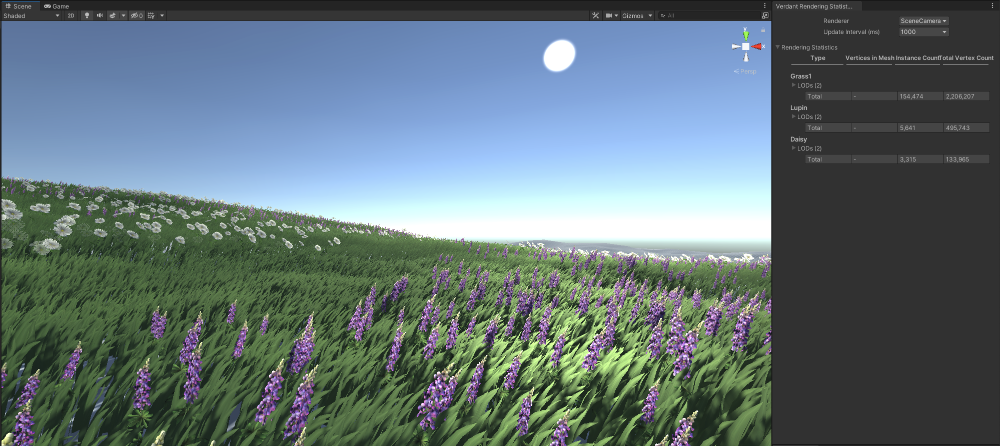

# Debug Panel

Verdant by itself can be a little opaque, so it comes with tools for inspecting its behaviour. The debug panel is the most important one and can be found in the menu bar by going to Verdant > Debug Panel. 

## Rendering statistics

The first thing you see when opening the panel is a list on the left with all the [VerdantCameras](../ComponentReference/VerdantCamera) in the scene, including any Verdant-rendering scene views. Select one and you'll see a table that displays each active [VerdantType](../ComponentReference/DataTypes/VerdantType) and [VerdantGroup]](../ComponentReference/DataTypes/VerdantGroup)  in its surroundings. Type groups can be opened up to show their members, and types themselves can be opened to show stats for each LOD. Each has the sum total of all its instances and vertices on the right. The table will update every second as the associated VerdantCamera moves around the scene.

This table is also available as its own smaller window that can be conveniently stashed in a corner while the game runs. You'll find it under the Verdant menu as Rendering Statistics. The standalone window can be configured to update at a faster rate, which can be useful when it's used to observe a scene in real time. Be aware that the readback will cause some overhead, so don't profile frame times while it is open.

## Fields

The section below the table shows you the contents of all the fields used by the camera. If you have added [affector fields](../ComponentReference/Fields) those will be shown first.

[Deflection](../ComponentReference/Fields/VerdantDeflectionField.html) here is shown as if it were a normal map, [color](../ComponentReference/Fields/VerdantColorField) is shown as it is and [scale](../ComponentReference/Fields/VerdantScaleField) is in greyscale where black is 0 and white is 1. 

As you will also see on the rest of the fields, they have a checkbox beneath them that allows you to visualize the field in the scene. If the field is high resolution it can be a little bit demanding on the GPU to do so, but it's a very intuitive way to show directly what affectors are doing and how the field resolution compares to the objects in your scene. 

Next are the detail and coarse heightfields used by VerdantCamera itself. As these fields contain full float values you can use the range sliders below them to adjust what values to use as maximum and minimum when mapping to greyscale. There's also a toggle to draw the scale of the field rather than the height. 

Finally, there is the culling tile map and the typemap. Culling tiles are what Verdant uses to determine what to draw, and when shown in the scene they are drawn as a bounding box. The colors represent the different types present in them, and you can use the layer mask above them to hide or show certain types. To the right is the detail typemap, which works similarly but has the same resolution and scale as the detail height field.

The fields will be updated if an object drawing to them is changed or if the camera moves out of range. You'll see the changes reflected immediately, both in the panel and scene view if used.