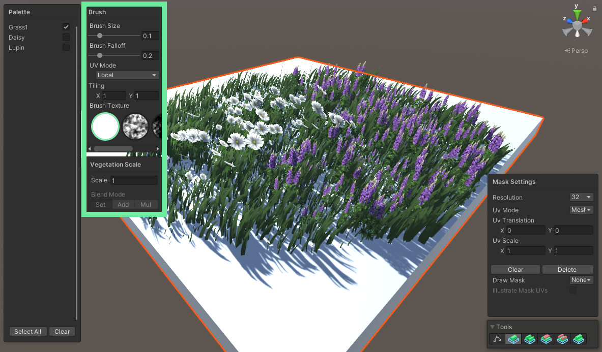
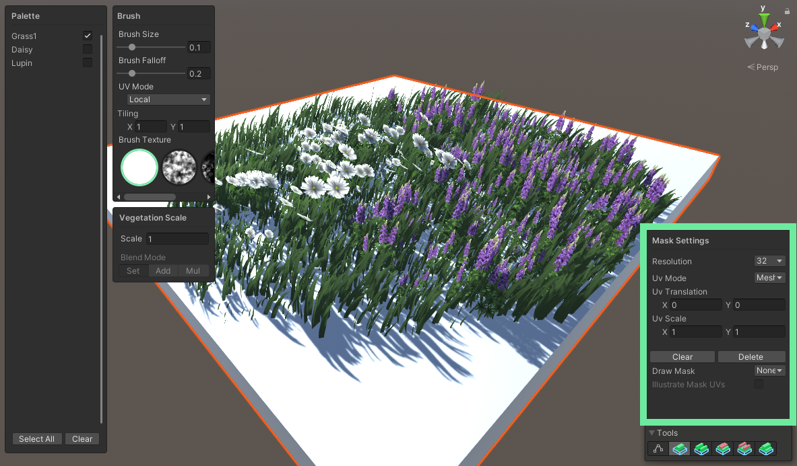

# Painting Mask Textures

Using regular mask textures on [VerdantObject](../ComponentReference/VerdantObject.html) can get you pretty far, but they only allow you to change the scale of vegetation. By using the internal Verdant tools for painting masks you can also paint [VerdantType](../ComponentReference/DataTypes/VerdantType)/[VerdantGroup](../ComponentReference/DataTypes/VerdantGroup) information directly into the mask. The experience is not dissimilar to vegetation painting tools you might be familiar with from elsewhere, but made to work with Verdant's particular paradigm. 

To paint a mask you first need a VerdantObject. Select it, then go down into the Masking Texture parameters and look for the header Painted Mask. Below it you'll see a resolution parameter, a row of tools and a textbox indicating that this object does not have a painted mask yet. Click on the Initialize button to create one. You'll see the UI change slightly. The tools are now ready to use, either from the component or in the scene view tool drawer (show it by clicking the icon of a crossed pen and spanner to the left of the Gizmos dropdown). When you do so you'll see a some new windows overlaid on the scene view.

On the left is the palette, which lets you choose which type to paint. The types are the same as the type list on the VerdantObject, so to add more you need to include them there. You can select multiple types and the checkboxes map to your numbers row, so by holding 1 you will select the first type, 2 the second, etc. 

To the right of the palette are two windows, one for Brush Settings and one for Scale. The brush settings allow you to set the Brush Size and Brush Falloff, which will be reflected in the drawn brush you see when mousing over the object. You can also set the UV mode and UV Scale of the brush, which determine how the brush texture will be used as you paint. There's a set of included brush textures, and you can add your own by creating a folder in your project called VerdantBrushes in Assets/Editor. Any textures in there will be picked up the next time a tool is loaded. 

The Vegetation Scale Settings are used to draw into the scale portion of the mask. It's a straightforward parameter where you set the scale you want your vegetation to be when it's drawn. The brush texture and falloff act as a multiplier on this value, as does the scale of the VerdantObject. When using the Scale Adjustment tool you can also select a blend mode, though that setting is disabled for other tools.

The last window contains the Mask Settings and allows you to change things about the mask itself. You can adjust the resolution, which will automatically scale the contents of the mask up or down, change the UV settings as you would any other mask texture, and clear or delete the mask. There are also two debug options. Draw Mask lets you view the type and scale masks as textures on the object. Illustrate Mask UVs will automatically be enabled when using any UV Mode other than Mesh UVs and shows where the UV plane is in relation to the mesh as a wireframe rectangle. 

## The Tools

There are five tools available to you. Each of them use different parts of the interface and will enable and disable them accordingly.

Furthest to the left is the Add Vegetation tool, which you use to draw in new vegetation. This is the most basic tool and the one you'll always use first. It writes in both the selected types and the scale, and will overwrite any existing data. Just mouse over the object, then click anywhere you want to draw in your type. You'll see it instantly.

The next one is Erase Vegetation, which is the obvious counterpart to Add Vegetation. It disables the Palette and Scale windows entirely, because all it does is remove any vegetation it's used on. If the brush is not entirely opaque because of its falloff or texture then it will scale vegetation towards zero instead.

After that is Add Vegetation Type. This tool allows you to add other types to areas that have been painted in with Add Vegetation. If you already have a good shape and you just want to say, add some flowers to it, this is the tool to use. It disables the Scale window, though it does still use the brush texture as a mask. That way you can add new types onto existing ones in interesting shapes.

Erase Vegetation Type is the equivalent of Erase Vegetation for Add Vegetation Type. To use it you must first select a type in the palette. It will then erase that type only and leave everything else intact.

The final tool is Scale Adjustment, which disables the palette completely and only modifies the scale. It enables the blending settings in the Scale window and allows for fine adjustments on existing vegetation. Most of the time it makes sense to first block in the general shape you want with Add Vegetation, then take a few passes over it with Scale Adjustment to add more variation and clean up lines. If an area is painted all the way down to zero scale it is erased as if Erase Vegetation was used.

## Resolution

Masks are serialized with the VerdantObject component, so it's important to not set the resolution higher than needed to keep the scene/prefab disk size under control. Start low and work upwards, it's always possible to increase it later. At very high resolution you might find the editor stuttering when you undo or redo. This happens because of the large amount of serailization work being performed in the background. It's not a problem for Verdant, but can be slightly cumbersome to work with.