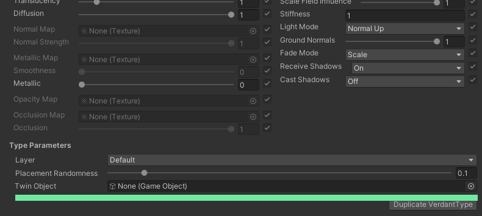
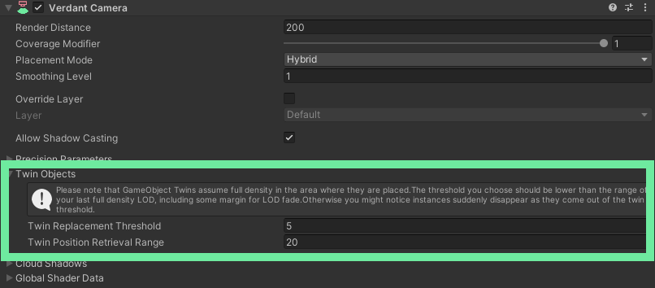

# Using Twin Objects
Twin objects are a useful way to take Verdant instances and dynamically transform them into full gameObjects when needed. By using them you can create the illusion of a much higher level of interaction than Verdant can normally support.

The basic principle is to replace [VerdantType](../ComponentReference/DataTypes/VerdantType) instances with gameObjects as the player approaches them. When close, an instance of a specified prefab is placed exactly where the GPU instance is. At the same moment the GPU instance is hidden. Once the [VerdantCamera](../ComponentReference/VerdantCamera) moves out of range the prefab instance is disabled and placed back into a pool while the GPU instance is activated again. When properly set up the effect is seamless and the two instances will look as if they were one and the same. 

## Setting up a Type

VerdantType has a parameter towards the very bottom called Twin Object. It takes a prefab, and when set Verdant will automatically start to replace instances of the type with it at runtime. The field accepts any prefab, but it must have a component inheriting from [VerdantGameObjectTwin](../ComponentReference/VerdantGameObjectTwin.html) on the root GameObject. It will throw an error at runtime otherwise.

## The Twin Object Prefab
VerdantGameObjectTwin is an abstract component that has four methods you need to implement to help manage the object over its lifecycle. As the camera moves around twins are added into and taken out of a pool of objects constantly. It's important that the object knows how to respond to these events in a performant way, and that it knows to reset itself so it can be reused correctly. Follow the link above to the component reference for more details about the methods.

If you're using twin objects as a way to animate complex vegetation physically, eg. rigging it up with joints, rigidbodies and colliders, then there's an included implementation of VerdantGameObjectTwin called VerdantPhysicalTwin that you can use. Add it to the root object and it will take care of all the physical components automatically. Note that objects like this are quite expensive to reset, so if you have a more narrow use case that you could optimize for it's very worth doing so.

## Visuals
Unless the twin prefab looks exactly the same as the VerdantType, replacing one with the other is not going to look right. If you haven't overridden it on the VerdantType you should use the Verdant Standard Shader on all the prefab materials and set the parameters as they are on the VerdantType. You should also [enable global parameters](AccessingVerdantData.html) on any relevant VerdantCamera parameters and on your [affector fields](../ComponentReference/Fields). That way the material will pick up on their contents and match the GPU instance look.

For the same reasons, make sure all the scales and rotations are the same. There shouldn't be any scaling or rotation applied on any of the prefab transforms unless it matches the mesh set on the VerdantType.

## Replacement Threshold and Retrieval Range

With the prefab set and the component implemented you should be able to run the game and see your instances be replaced. To make this clearer it can be useful to temporarily set a different color or some other conspicuous difference on the twin materials.  

There are two more parameters we need to look at: Replacement Threshold and Retrieval Range. These rather confusingly named parameters control how and when instances are replaced. To understand them it helps to know a bit about how the system works in the background. Verdant will read back the positions closest to the camera from the GPU and store them CPU-side. It then keeps track of these positions and places twins on them when the camera is close enough. "Close enough" here is the replacement threshold. So basically, retrieval range controls the area that Verdant is aware of, and replacement threshold is the distance at which a GPU instance becomes a prefab instance.

Normally you can just set Retrieval Range to about double Replacement Threshold. That gives plenty of margin while not forcing Verdant to read too much at once. If the camera moves fast increasing Retrieval Range can help make reads less frequent. If the CPU ends up chugging on all the positions or you have hitches from reading back the positions then decrease it instead.

Also note that twin objects always assume full density, so the replacement threshold should be within the falloff steps where density is at maximum. If there is falloff applied Verdant will try to replace instances that are no longer there. If you need a threshold bigger than the first falloff step then increase it so you have more than one step at maximum.

## Testing
An important thing to know is that twin object replacement is intentionally disabled in edit mode. This prevents twins from being accidentally created and saved with the scene. In play mode it will run on both the scene view camera (if enabled) and the regular VerdantCamera, although it is usually best to test them using the VerdantCamera. There can be inconsistencies with global shader values when both are active.

## Performance
In terms of pure management twin objects are quite performant. Most of the performance cost actually comes from the gameObjects themselves. Unity doesn't handle large numbers of gameObjects all that well and some components can become very expensive at scale. Enabling and disabling a lot of objects can also be heavy, which is why it's important to implement [VerdantGameObjectTwin](../ComponentReference/VerdantGameObjectTwin.html) correctly. If the type is dense and the player moves fast then it's likely that dozens of objects are brought in and out of the pool per frame. In general you should only reset what you strictly have to. The less state each instance has the better.

