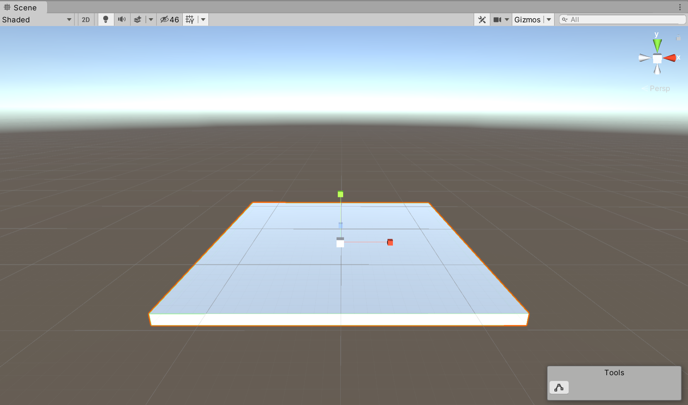
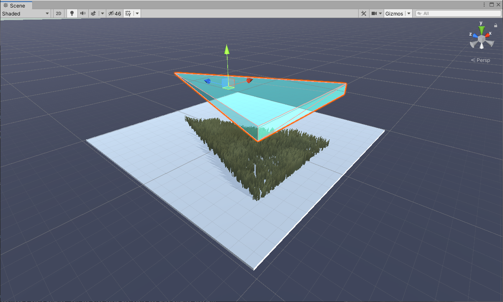
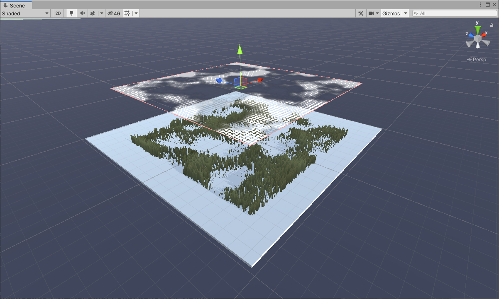
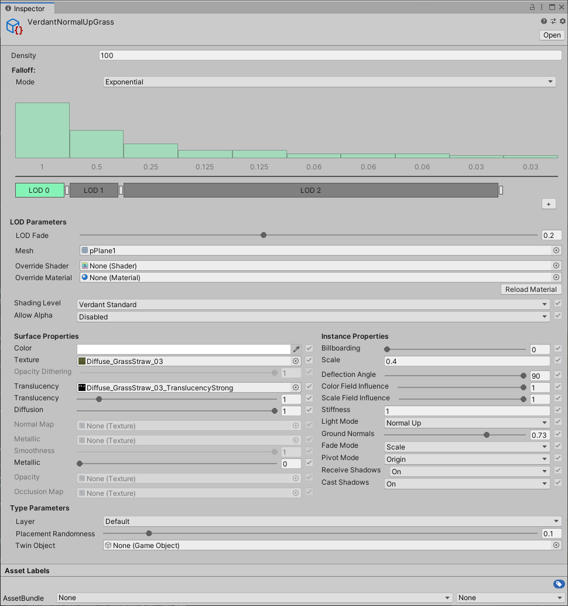
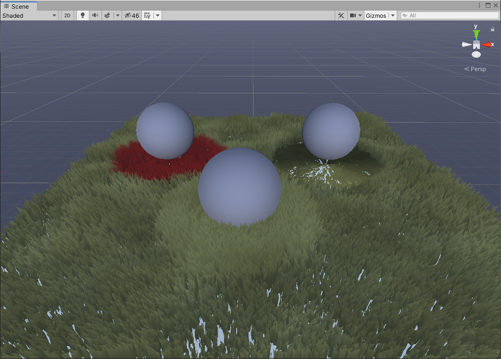

### Welcome!
{: .no_toc }
I'm so happy you're interested in testing Verdant! This page will take you through the process of getting everything set up.

## Table of contents
{: .no_toc .text-delta }

1. TOC
{:toc}

## Setup
To use Verdant, you first need to have Unity installed. Any version from 2019.3 onward should work. If you already have a compatible version, use that! Otherwise, install the latest 2019 version or any 2020 version you'd like. A spread of different versions is good, it helps us cover more ground when debugging. You can find them here: https://unity3d.com/get-unity/download.

Once you have a Unity version downloaded, start a new project (or open an existing one if you have something specific you want to use Verdant for). When the project has loaded, go to Window > Package Manager. There's a plus symbol in the uppper left corner. Click that and select Add Package From Disk. Navigate to the folder where you extracted Verdant and find the file packagemanifest inside. Select it and wait for everything to import.

Now open Window > General > Console. If there are no errors in red you are ready to start using Verdant!

### First steps
We'll start with a very simple scene just to make sure everything's working. Create a cube and scale it up in X and Z. This will be our ground. 

Then, add the component VerdantCamera on the camera. You can leave all the settings on default.

On the ground object, add the component VerdantObject. In the Types list, set the length to 1 and select the type VerdantNormalUpGrass. This will make it so the specified Verdant type appears all over the object.

Finally, go to Verdant > Render in Editor. Your cube should be covered in grass.

## The Verdant Workflow
You might have noticed that Verdant has a slightly different workflow from most vegetation systems. The primary interaction in Verdant is defining zones, rather than painting instances onto surfaces. You add VerdantObject to any objects you want vegetation on. The coverage can then be controlled by either using another Verdant Object as a mask or by applying a scale texture. You can also paint the scale and type texture directly. 

The setting "Mode" on VerdantObject decides whether an object should be a surface onto which vegetation should be placed or if it should be treated as a mask. In the image above, the box has a VerdantObject but no types. The triangle above is a mask VerdantObject which has VerdantNormalUpGrass set as type. This makes it so a triangular zone of grass gets projected down onto the terrain. Any scale texture on the mask object also gets factured in.

If you just want to apply a scale texture to your scene the best way is to use the Map mode on the VerdantShapeDescriptor. This will draw the object as an XZ aligned plane with the scale texture mapped onto it. 

Verdant can also be used on terrains with the special VerdantTerrain component. You can mostly use it exactly like you would a normal VerdantObject, but it also plugs into the texture layers of the terrain. You'll have to set the index of each type to the layer onto which they should be placed.

## Wind
To add wind to your scene, create a new GameObject and add the component VerdantWindVolume to it. While your camera is inside the volume it will apply its parameters to all the visible vegetation in the scene.

As you enter the volume it will interpolate all the settings for the duration set in Transition Time. Wind is measured on the Beaufort Scale, which is a twelve point scale that comes with helpful labels describing each step in familiar terms. You control the general strength using the Beaufort slider. Gustiness determines how much the wind should use the wind noise, which will create clear shapes like gusts traveling along the ground. You can set the wind noise to any repeating greyscale texture you like, though Verdant provides the texture ChoppyWindNoise for you. The size of the volume is controlled by its Extents.

Wind volumes can be nestled and overlap. The wind will be applied as you move into each volume and restored as you move out. If the camera starts inside a nestled volume it will use it if it's fully contained by the higher volumes. If they only partially overlap the result is undefined, so try to spawn the camera in a non-overlapping area.

## Adding New Types
To add a Verdant Type of your own, go to the Project Window and click the plus icon in the top left corner. Go to the category Verdant at the very top and select Verdant Type. This will create a new Verdant Type Asset.

### Type Parameters
There are a ton of things you can change on a Verdant Type. The inspector is split from top to bottom into five parts:

* At the top you have the density, which is the number of instances per square meter. You can set this number to anything you want, but I recommend you keep it between 0.01 and 500.
* The bar graph represents falloff, which is how the density changes over distance from the camera. Falloff happens in ten discreet sections with some smoothing between them. You can select a preset falloff mode or use custom to adjust the graph manually. 1 represents full density and 0 represents none. Each bar reoresebts 1/10th of the VerdantCamera render distance.
* Below the bar graph are the LOD controls. You can use the plus button to add an LOD and the handles between them to adjust which falloff sections use which LODs. It's almost always a good idea to have at least one high quality LOD for the first bar or two and one slightly simpler version extending through all the subsequent bars. Clicking on an LOD bar will select it and show its parameters.
* The parameters below are per LOD parameters. They come in two flavors: Surface properties, which map very cleanly to the properties you might find on a regular material, and instance properties, which control various things about the placement and animation of the mesh itself. LOD parameters have the very useful property that they are individually optional on all LODs but the first. When you create a new LOD it inherits all the parameters from the previous one. When the parameter has a checkbox, checking it will override the inherited value. For the mesh, shader and material, simply changing them to anything but null will count as an override. This makes it very quick and efficient to experiment with different LOD counts and make changes on the fly.
* Finally, starting with layer, you have per type parameters that apply to all the LODs.

You can edit Verdant Types while you are using them. Your changes will be reflected in the editor instantly.

Two LOD parameters are particularily important. The Shading Level and Allow Alpha settings will control which other parameters are available to you. You should always pick the lowest level you can get away with. If your vegetation is very dense it can make a huge difference for performance. Remember that you can even bump it down for later LODs!

### Verdant Groups

Any number of different types can be combined into one by using a Verdant Group. This can be a very convenient way to combine multiple versions of the same plant or to design more complex biomes that can be reused easily. Verdant Group lets you add multiple different types, adjust the density ratio of each and choose a new density and falloff used for all of them. They can be used anywhere you might use a regular Verdant Type.

## Interacting with Verdant In-Game
Verdant has three different built in ways for GameObjects to interact with vegetation: Deflecting it as they pass through, coloring it or changing its scale.

### Affectors

All of these interactions are facillitated by the use of Affectors. Affectors are similar to VerdantObjects in mask mode, they influence the underlying vegetation based on the shape of a mesh. Unlike VerdantObjects they are designed to change and move around frequently without a large performance cost. This means you can stick them on players, swords, vehicles, or wherever else you like.

To use either interaction mode you first need to add its field component to the camera. These are VerdantDeflectionField, VerdantColorField and VerdantScaleField.

For each field there is an affector component which you will need to add to your interacting GameObjects. VerdantDeflectionAffector, VerdantColorAffector and VerdantScaleAffector. The three share many parameters. By default they are only recognized when they pass through the ground. You can change the accepted range from the ground by using Height Bias, or make them ignore the distance entirely by checking Ignore Height. All affectors can also have a texture to control what gets drawn to the field. 
Like VerdantObject, the shape of an affector is determined by its accompanying VerdantShapeDescriptor.

The field components also share some useful parameters. The scale determines how large the field is in units around the camera. Affectors outside of this range won't be able to influence it at all. Scale and Color fields both let you set a base texture, which will be repeated below any affectors you add. This is a great way to add a bit of universal variance to your fields. The wrap mode determines what happens to vegetation outside the range of the field. If you're primarily using affectors you should use clamp. If you're primarily using the base texture you should use repeat. Finally, the restoration over time option lets you fade out the marks left by your affectors. You'll need to specify a restoration rate and a number of updates per second. Note that increasing Updates Per Second can have a significant performance impact.

#### Deflection
Deflection is different from the other two in that it performs a simulation. It is always updating a set number of times per second, and that number should only be changed rarely because it can have a big impact on your visuals. Simulations are interpolated and smooth no matter the frame rate, but a 20FPS field and a 60FPS field will move in very different ways. The other parameters rely on a steady update rate, so changing it will cascade to having to adjust them too. 

Each pixel in the field is modeled as a spring. The drag is how much energy the spring should lose as it bounces back and forth. The springiness is the strength of the spring. Low drag will give you grass that sways back and forth endlessly, while a high springiness will increase the speed of the swaying. Timescale is simply a multiplier on the animation speed.

The affectors can either be set to push or press. Push acts as a force on the field. It can be subtle or strong, but will at most push vegetation down fully before immediately springing back. Press always pushes everything down fully, but lets you control how long it should stay down in seconds. The former might be useful for a character gently moving through a field, where the latter is more like a large rolling rock or the wheels of a vehicle.

### The Debug Panel
If you want to learn more about affectors and fields it might be interesting to check the Verdant debugging panel. You can find it in the menu bar under Verdant > Debug Panel

Select the camera you want to inspect on the left. The table at the top shows real time information for how many instances are being rendered at any given moment. The numbers will change as you move the camera. 

Below the table are a series of boxes that show illustrations of the data in each field. You can also visualize them directly in the scene by checking the box Draw In Scene. Hide Vegetation in the lower left corner can also be useful to mark if your vegetation is thick enough to obscure the visualization. 

## Questions and Answers
Q. Can I use this with any of the new Unity rendering pipelines?
A. Not in this version, but I expect to support both HDRP and URP post release.

Q. Why does the vegetation on my VerdantObject disappear when I place another VerdantObject above it?
A. This is an unfortunate but unavoidable quirk in how Verdant works. Because everything is treated as one large field there can only be one Verdant instance per Y value. A way to get around it is to create a material with the Verdant Standard Shader and place som instances manually.