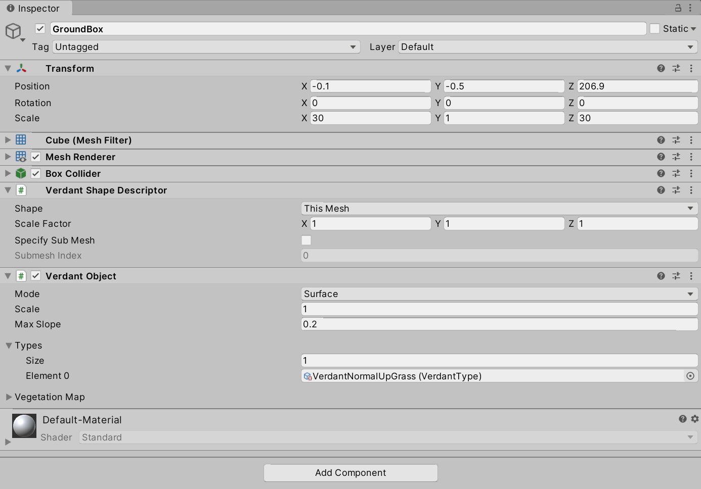

# Getting Started
{: .no_toc }

This page will get you up and running with Verdant in your project.

## Table of contents
{: .no_toc .text-delta }
1. TOC
{:toc}

## What is Verdant?

Chances are you already have some idea seeing how you're here, but I want to give a quick introduction regardless. Verdant is a system for rendering vegetation in Unity. It is a procedural system that excels at rendering dense fields in large worlds, be they carefully handcrafted or generated at runtime. When you work with Verdant you will rarely be placing anything directly. Rather, you’ll tell the system which parts of the world you want covered in vegetation. This gives you a bit less control than you might be used to, but also allows for unparalleled flexibility, speedy iteration and keeps your scenes and prefabs lightweight. You won’t need to wrangle any large data structures and the system never needs to load anything from disk. All while keeping a small, constant memory footprint, regardless of the size of your scene.

## Basic Setup

If this is your first time using the system, I suggest starting from a blank scene and going through the procedure once before trying it in your existing scenes. This will preemptively help you isolate any issues or conflicts you might have.

Once you’ve imported Verdant, go to your main camera and add the component ’VerdantCamera’. There’s a lot of settings here, but the defaults will serve you well for now.

### Deferred Rendering

With the camera added you'll notice one of two things right away: 1) If you're using forward rendering, there'll be an info box recommending you use deferred. This has to do with how Verdant performance differs between the two, the details of which is discussed at length in [Performance](Performance.html). You can absolutely use forward, but do make sure you double check the performance guide so you're fully aware of the consequences and pitfalls! 2) If you were already using or just switched to deferred rendering, it'll display a warning telling you to change the default deferred shader to one customized for Verdant which includes special light modes and translucency support. Without it you'll run into strange lighting artifacts quickly, so just click "Apply Shader" and Verdant will take care of all that for you. 

With the camera and shading path set up, choose an object in the scene or create a new box or plane to serve as your ground. Any ground-like object with a MeshRenderer will do.

Add the component ’VerdantObject’ to it. Then, under the list Verdant Types, add the included type ’VerdantNormalUpGrass’. You might need to click the eye icon in the upper right corner to see it.

Your VerdantObject component should now look like this:

Make sure the object is in view of the camera. You should now be able to hit play and see something like the below!

You can also preview Verdant in the scene view. Go to the menu bar and select Verdant > Render in Editor. Try moving your VerdantObject around a bit and see how it updates in real time as you work. Be aware that the scene view preview will perform worse than a build, so it can be a little heavy on lower end systems.

Finally, the vegetation is looking a little bit stiff at the moment, so we should add some wind. Create a new GameObject and add the component VerdantWindVolume to it. If gizmos are enabled you will be able to see the volume as a blue box when it is selected. When the camera enters it a gentle breeze should rise through your field!  

## Quick Setup

We've done everything manually for illustration purposes here, but there are also shortcuts available for creating GameObjects configured with common Verdant components. Go to the Create menu in the Hierarchy view and you'll find a section for Verdant. "Surface Object" and "Wind Volume" here are very similar to the objects we just created. The others are things you'll soon become familiar with through the remaining guides!

## Your next steps

You've now tried the basics, but there are many other things to discover in Verdant. Next we will take a look at the Verdant workflow to help you understand how to build scenes. [Continue on the Workflow page](Workflow.html). 
